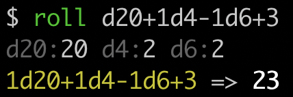

# dicelang: dice expression parser and evaluator in Rust

Rust crate capable of parsing and evaluating dice expressions like
`d20+1d4-1d6+3`. The main crate (here) provides parsing and evaluation
facilities. There are also sub-crates for [CLI](./dicelang-cli) and [WebAssembly (WASM)](./dicelang-wasm) support. See their
READMEs for more more information.

A live WASM demo can be found on my [website](https://michaeldresser.io/).

## Acknowledgements

Many thanks to Robert Nystrom's book _Crafting Interpreters_ for providing the foundation for this small project.
